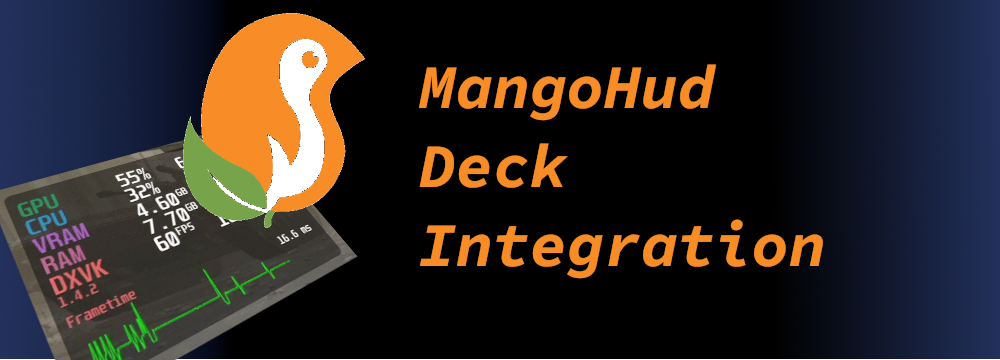
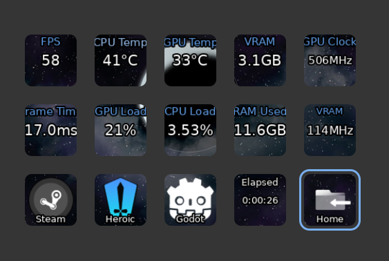
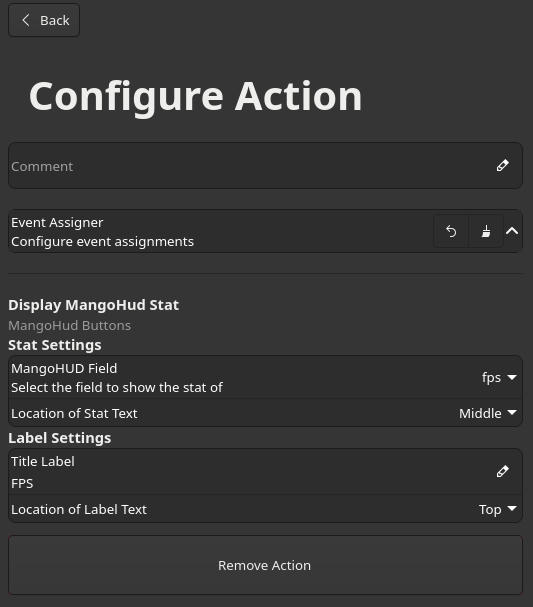
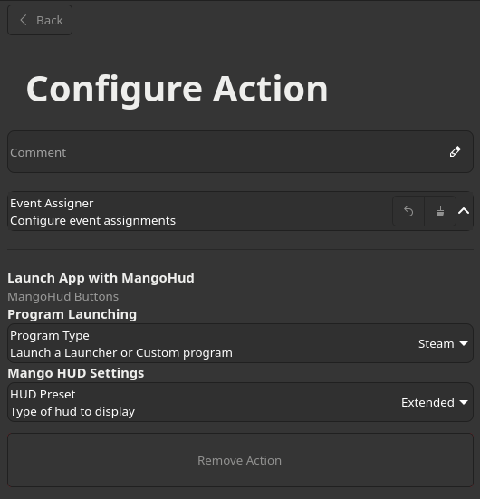
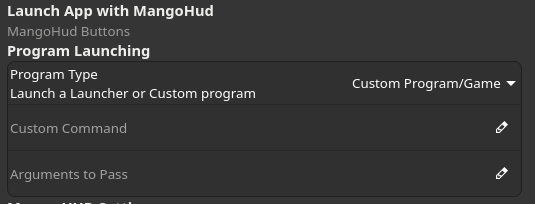

# MangoHud Plugin for StreamController

## What is it?
This is a plugin for StreamController to interface with MangoHud, in a similar fashion as HWInfo on Windows.  It reads the log generated
by MangoHUD and parses the information to be displayed as buttons on the Stream Deck.

## Setup

Once you have installed the Plugin from the StreamController store, you can add an action to a button, and Select MangoHud Buttons, then select one of the three options:

- Display MangoHud Stat
- Launch App with MangoHud
- Toggle MangoHUD

## Display MangoHud Stat

In this section, you can configure the Stat, and Label settings for Mango Hud.  When Selecting a field to be displayed, the Title Label will automatically update with
a default option.  You can always change this if you wish.  Also in her, you can select where you want your label to be shown, as well as the Stat.  The plugin utilizes
the existing Labels present in StreamController Deck Button for displaying both of these labels.  You can modify the font, size and color, once you have picked the
location you want the stat and label to be shown in.

## Launch App with MangoHud

MangoHud operates in a fashion, where it hooks directly into the Graphics rendering library that your app/game uses.  Threfore, in order for this injection to properly
occur, the app needs to be run with MangoHUD.  The two most popular store fronts/game launchers are already setup here, Steam and Heroic Game Launcher.  But you also have
the option to launch a Custom Command, in which you provide the command line to launch the program you want with Mango HUD.

The other option here is the ability to set what Preset of the Overlay HUD to use, and there's 4 to choose from.

- FPS Only  (Only shows the FPS Counter)
- Bar (Shows a horizontal bar at the top with basic information)
- Extended (Small box with essential information to be displayed)
- Detailed (This gives you the most detailed information about what is being recorded.)

By default, the hud needs to be shown at least once, in order for logging to start properly.  A solution to this, is to wait till the plugin get's the first line of data
from the log file, and it will automatically hide the hud for you.

## Toggle MangoHUD

There is no configuration needed for this action.  It will simply send a command to MangoHUD to toggle the Hud on or off when you press the button.  Everything else is
handled by the plugin.

## FAQ

- **Q:** **Do I need to launch the app through a Deck Button?**\
  **A:** You don't.  But you do need to ensure that the MANGOHUD_CONFIG environment variables are properly setup.\
  MANGOHUD_CONFIG=log_interval=100,autostart_log=1,control=/run/user/{uid}/scmango-%p,output_folder=/tmp/sc_mangohud \
  {uid} is your uesr id, EG: /run/user/1000/scmango-%p
- **Q:** **I launched an app with mangohud, and have the proper environment variables, but my buttons are not updating to show the stats?**\
  **A:** If you use the option no_display, or preset=0 in the configuration of MangoHUD, the HUD will not display, and logging doesn't \
  start, till the hud properly displays on the screen.
- **Q:** **I'm not getting any response from any of the buttons I created, what is going wrong?**\
  **A:** In order to read the log files of MangoHud, we use the system's python interpreter.  Recently, Python was updated to 3.14.  If you
  type in a terminal `python --version` and it doesn't show `Python 3.13.11` as the latest possible version, then there may be issues installing
  the latest version of the Python Libraries WatchFiles or some other library, that hasn't been updated to work with 3.14 yet.  You can downgrade
  Python back to 3.13, or wait for Python Libraries to be updated.